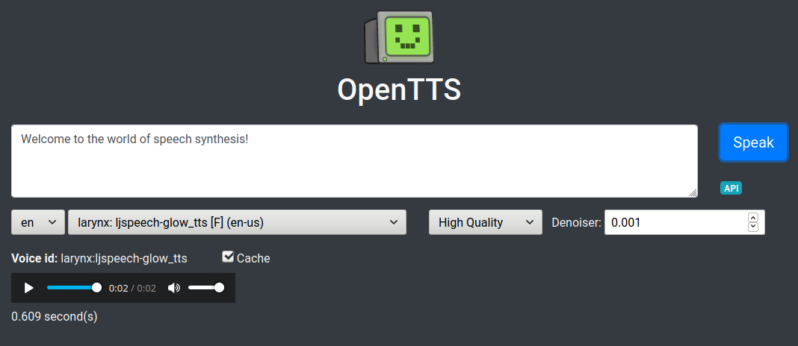

# Open Text to Speech Server

Unifies access to multiple open source text to speech systems and voices for [many languages](#running).

Supports a [subset of SSML](#ssml) that can use multiple voices, text to speech systems, and languages!

``` xml
<speak>
  The 1st thing to remember is that 27 languages are supported in Open TTS as of 10/13/2021 at 3pm.

  <voice name="glow-speak:en-us_mary_ann">
    <s>
      The current voice can be changed, even to a different text to speech system!
    </s>
  </voice>

  <voice name="coqui-tts:en_vctk#p228">
    <s>Breaks are possible</s>
    <break time="0.5s" />
    <s>between sentences.</s>
  </voice>

  <s lang="en">
    One language is never enough
  </s>
  <s lang="de">
   Eine Sprache ist niemals genug
  </s>
  <s lang="ja">
    言語を一つは決して足りない
  </s>
  <s lang="sw">
    Lugha moja haitoshi
  </s>
</speak>
```

See the [full SSML example](https://github.com/synesthesiam/opentts/blob/master/etc/ssml_example.xml) (use `synesthesiam/opentts:all` Docker image with all voices included)

[Listen to voice samples](https://synesthesiam.github.io/opentts/)



## Voices

* [Larynx](https://github.com/rhasspy/larynx)
    * English (27), German (7), French (3), Spanish (2), Dutch (4), Russian (3), Swedish (1), Italian (2), Swahili (1)
    * Model types available: [GlowTTS](https://github.com/rhasspy/glow-tts-train)
    * Vocoders available: [HiFi-Gan](https://github.com/rhasspy/hifi-gan-train) (3 levels of quality)
    * Patched embedded version of Larynx 1.0
* [Glow-Speak](https://github.com/rhasspy/glow-speak)
    * English (2), German (1), French (1), Spanish (1), Dutch (1), Russian (1), Swedish (1), Italian (1), Swahili (1), Greek (1), Finnish (1), Hungarian (1), Korean (1)
    * Model types available: [GlowTTS](https://github.com/rhasspy/glow-tts-train)
    * Vocoders available: [HiFi-Gan](https://github.com/rhasspy/hifi-gan-train) (3 levels of quality)
* [Coqui-TTS](https://github.com/coqui-ai/TTS)
    * English (110), Japanese (1), Chinese (1)
    * Patched embedded version of Coqui-TTS 0.3.1
* [nanoTTS](https://github.com/gmn/nanotts)
    * English (2), German (1), French (1), Italian (1), Spanish (1)
* [MaryTTS](http://mary.dfki.de)
    * English (7), German (3), French (4), Italian (1), Russian (1), Swedish (1), Telugu (1), Turkish (1)
    * Includes [embedded MaryTTS](https://github.com/synesthesiam/marytts-txt2wav)
* [flite](http://www.festvox.org/flite)
    * English (19), Hindi (1), Bengali (1), Gujarati (3), Kannada (1), Marathi (2), Punjabi (1), Tamil (1), Telugu (3)
* [Festival](http://www.cstr.ed.ac.uk/projects/festival/)
    * English (9), Spanish (1), Catalan (1), Czech (4), Russian (1), Finnish (2), Marathi (1), Telugu (1), Hindi (1), Italian (2), Arabic (2)
    * Spanish/Catalan/Finnish use [ISO-8859-15 encoding](https://en.wikipedia.org/wiki/ISO/IEC_8859-15)
    * Czech uses [ISO-8859-2 encoding](https://en.wikipedia.org/wiki/ISO/IEC_8859-2)
    * Russian is [transliterated](https://pypi.org/project/transliterate/) from Cyrillic to Latin script automatically
    * Arabic uses UTF-8 and is diacritized with [mishkal](https://github.com/linuxscout/mishkal)
* [eSpeak](http://espeak.sourceforge.net)
    * Supports huge number of languages/locales, but sounds robotic
    
## Running

Basic OpenTTS server:

```bash
$ docker run -it -p 5500:5500 synesthesiam/opentts:<LANGUAGE>
```

where `<LANGUAGE>` is one of:

* all (All languages)
* ar (Arabic)
* bn (Bengali)
* ca (Catalan)
* cs (Czech)
* de (German)
* el (Greek)
* en (English)
* es (Spanish)
* fi (Finnish)
* fr (French)
* gu (Gujarati)
* hi (Hindi)
* hu (Hungarian)
* it (Italian)
* ja (Japanese)
* kn (Kannada)
* ko (Korean)
* mr (Marathi)
* nl (Dutch)
* pa (Punjabi)
* ru (Russian)
* sv (Swedish)
* sw (Swahili)
* ta (Tamil)
* te (Telugu)
* tr (Turkish)
* zh (Chinese)

Visit http://localhost:5500

For HTTP API test page, visit http://localhost:5500/openapi/

Exclude eSpeak (robotic voices):

```bash
$ docker run -it -p 5500:5500 synesthesiam/opentts:<LANGUAGE> --no-espeak
```

### WAV Cache

You can have the OpenTTS server cache WAV files with `--cache`:

```bash
$ docker run -it -p 5500:5500 synesthesiam/opentts:<LANGUAGE> --cache
```

This will store WAV files in a temporary directory (inside the Docker container). A specific directory can also be used:

```bash
$ docker run -it -v /path/to/cache:/cache -p 5500:5500 synesthesiam/opentts:<LANGUAGE> --cache /cache
```

## HTTP API Endpoints

See [swagger.yaml](swagger.yaml)

* `GET /api/tts`
    * `?voice` - voice in the form `tts:voice` (e.g., `espeak:en`)
    * `?text` - text to speak
    * `?cache` - disable WAV cache with `false`
    * Returns `audio/wav` bytes
* `GET /api/voices`
    * Returns JSON object
    * Keys are voice ids in the form `tts:voice`
    * Values are objects with:
        * `id` - voice identifier for TTS system (string)
        * `name` - friendly name of voice (string)
        * `gender` - M or F (string)
        * `language` - 2-character language code (e.g., "en")
        * `locale` - lower-case locale code (e.g., "en-gb")
        * `tts_name` - name of text to speech system
    * Filter voices using query parameters:
        * `?tts_name` - only text to speech system(s)
        * `?language` - only language(s)
        * `?locale` - only locale(s)
        * `?gender` - only gender(s)
* `GET /api/languages`
    * Returns JSON list of supported languages
    * Filter languages using query parameters:
        * `?tts_name` - only text to speech system(s)

## SSML

A subset of [SSML](https://www.w3.org/TR/speech-synthesis11/) is supported:

* `<speak>` - wrap around SSML text
    * `lang` - set language for document
* `<s>` - sentence (disables automatic sentence breaking)
    * `lang` - set language for sentence
* `<w>` / `<token>` - word (disables automatic tokenization)
* `<voice name="...">` - set voice of inner text
    * `voice` - name or language of voice
        * Name format is `tts:voice` (e.g., "glow-speak:en-us_mary_ann") or `tts:voice#speaker_id` (e.g., "coqui-tts:en_vctk#p228")
        * If one of the supported languages, a preferred voice is used (override with `--preferred-voice <lang> <voice>`)
* `<say-as interpret-as="">` - force interpretation of inner text
    * `interpret-as` one of "spell-out", "date", "number", "time", or "currency"
    * `format` - way to format text depending on `interpret-as`
        * number - one of "cardinal", "ordinal", "digits", "year"
        * date - string with "d" (cardinal day), "o" (ordinal day), "m" (month), or "y" (year)
* `<break time="">` - Pause for given amount of time
    * time - seconds ("123s") or milliseconds ("123ms")
* `<sub alias="">` - substitute `alias` for inner text

## MaryTTS Compatible Endpoint

Use OpenTTS as a drop-in replacement for [MaryTTS](http://mary.dfki.de/).

The voice format is `<TTS_SYSTEM>:<VOICE_NAME>`. Visit the OpenTTS web UI and copy/paste the "voice id" of your favorite voice here.

You may need to change the port in your `docker run` command to `-p 59125:5500` for compatibility with existing software.

### Larynx Voice Quality

On the Raspberry Pi, you may need to lower the quality of [Larynx](https://github.com/rhasspy/larynx) voices to get reasonable response times.

This is done by appending the quality level to the end of your voice:

```yaml
tts:
  - platform: marytts
    voice:larynx:harvard;low
```

Available quality levels are `high` (the default), `medium`, and `low`.

Note that this only applies to Larynx and Glow-Speak voices.

### Speaker ID

For multi-speaker models (currently just `coqui-tts:en_vctk`), you can append a speaker name or id to your voice:

```yaml
tts:
  - platform: marytts
    voice:coqui-tts:en_vctk#p228
```

You can get the available speaker names from `/api/voices` or provide a 0-based index instead:

```yaml
tts:
  - platform: marytts
    voice:coqui-tts:en_vctk#42
```

## Default Larynx Settings

Default settings for [Larynx](https://github.com/rhasspy/larynx) can be provided on the command-line:

* `--larynx-quality` - vocoder quality ("high", "medium", or "low", default: "high")
* `--larynx-noise-scale` - voice volatility (0-1, default: 0.667)
* `--larynx-length-scale` - voice speed (< 1 is faster, default: 1.0)

---

## Building From Source

OpenTTS uses [Docker buildx](https://docs.docker.com/buildx/working-with-buildx/) to build multi-platform images based on [Debian bullseye](https://www.debian.org/releases/bullseye/).

Before building, make sure to download the voices you want to the `voices` directory. Each TTS system that uses external voices has a sub-directory with instructions on how to download voices.

If you only plan to build an image for your current platform, you should be able to run:

``` sh
make <lang>
```

from the root of the cloned repository, where `<lang>` is one of the [supported languages](#running). If it builds successfully, you can run it with:

``` sh
make <lang>-run
```

For example, the English image can be built and run with:

``` sh
make en
make en-run
```

Under the hood, this does two things:

1. Runs the `configure` script with `--languages <lang>`
2. Runs `docker buildx build` with the appropriate arguments

You can manually run the `configure` script -- see `./configure --help` for more options. This script generates the following files (used by the build process):

* build_packages - Debian packages installed with `apt-get` during the build only
* packages - Debian packages installed with `apt-get` for runtime
* python_packages - Python packages installed with `pip`
* .dockerignore - Files that docker will ignore during building ("!" inverts)
* .dockerargs - Command-line arguments passed to `docker buildx build`

### Multi-Platform images

To build an image for a different platform, you need to initialize a docker buildx builder:

``` sh
docker run --rm --privileged multiarch/qemu-user-static --reset -p yes
docker buildx create --config /etc/docker/buildx.conf --use --name mybuilder
docker buildx use mybuilder
docker buildx inspect --bootstrap
```

**NOTE:** For some reason, you have to do these steps *each time you reboot*. If you see errors like "Error while loading /usr/sbin/dpkg-split: No such file or directory", run `docker buildx rm mybuilder` and re-run the steps above.

When you run `make`, specify the platform(s) you want to build for:

``` sh
DOCKER_PLATFORMS='--platform linux/amd64,linux/arm64,linux/arm/v7' make <lang>
```

You may place pre-compiled Python wheels in the `download` directory. They will be used during the installation of Python packages.

